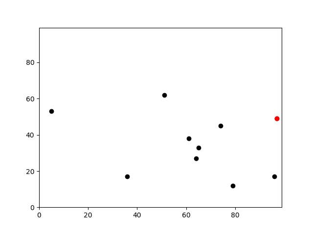
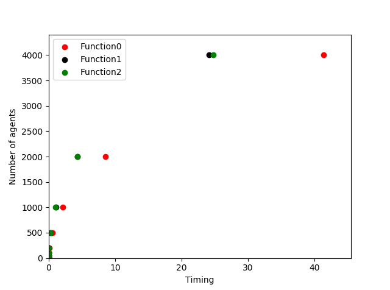
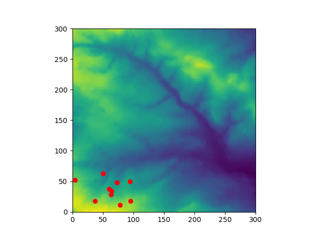
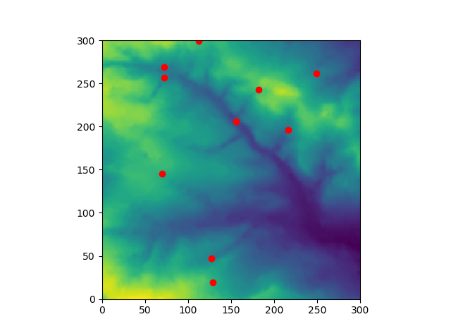
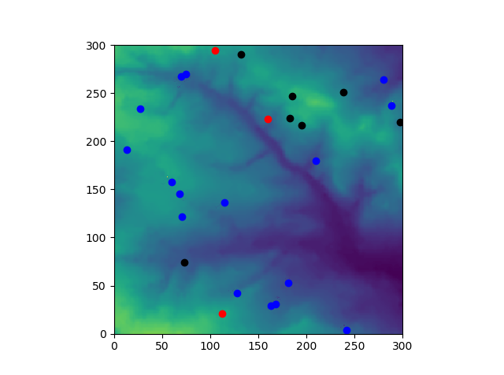
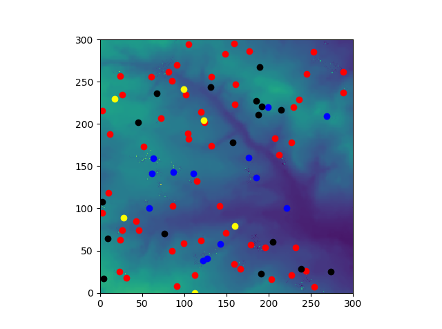
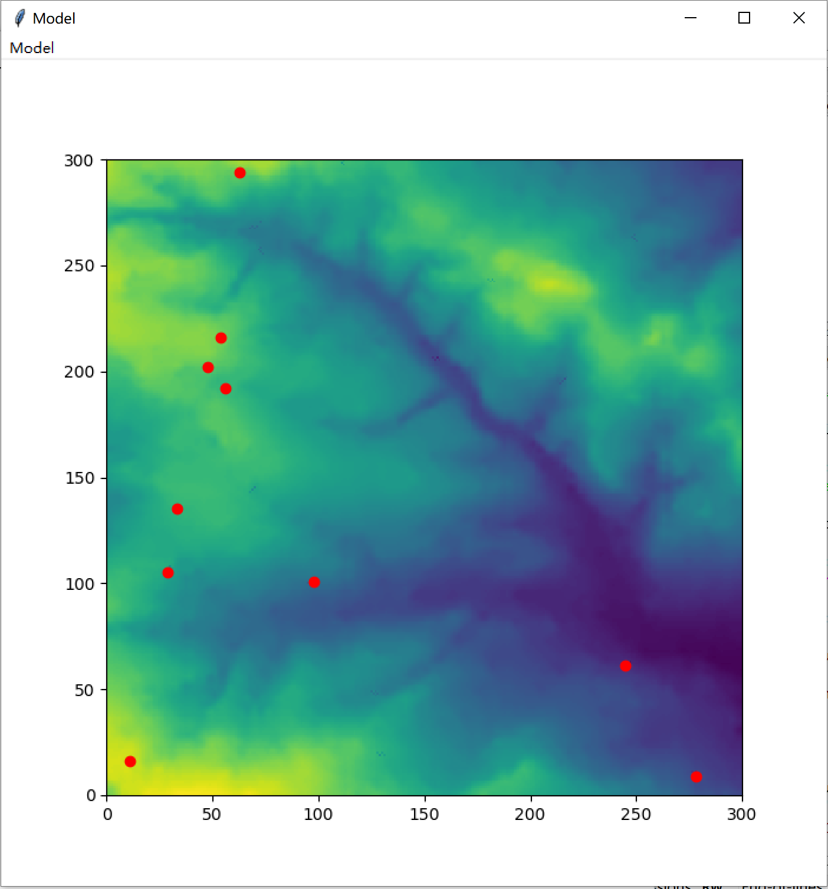

# Programming for Social Science

This code is only used as the practicals (Agent Based Modelling) for the module "[Programming for Social Science](https://www.geog.leeds.ac.uk/courses/computing/study/core-python-phd/)". More information about this assessment can be found [here](https://www.geog.leeds.ac.uk/courses/computing/study/core-python-phd/assessment1/index.html).

The website that introduces this code is [here](https://taaowen.github.io/ABM.html).

[toc]

---

## Mathematic Model

Note: You **NEED** to install [MathJax Plugin for Github](https://chrome.google.com/webstore/detail/mathjax-plugin-for-github/ioemnmodlmafdkllaclgeombjnmnbima/related) in Chrome to read the math formulates in GitHub. You can also access math formulates by other ways if you can.

Before illustrating how to simulate, the mathematic model is introduced first. There are two types of species, that is, sheep $S = [s_1, s_2, ..., s_n]$ and wolves $W = [w_1,w_2,...,w_m]$, where the numbers of sheep and wolves are $n$ and $m$ respectively. All species are given in the environment ${E_{\left| N \right| \times \left| N \right|}} = \left[ {\begin{array}{*{20}{c}}
{{e_{11}}}& \cdots & \cdots &{{e_{1\left| N \right|}}}\\
 \vdots & \ddots & \cdots & \vdots \\
 \vdots & \cdots &{{e_{ij}}}& \vdots \\
{{e_{\left| N \right|1}}}& \cdots & \cdots &{{e_{\left| N \right|\left| N \right|}}}
\end{array}} \right]$, where $e_{ij}$ represents the store of environment and the size of environment is $\left| N \right| \times \left| N \right|$. The details of our model are given below. (**All <u>*Options*</u> have been done in our code, but users need to uncomment specific code blocks to simulate it. Please refer to two python files for more details.**)

1. Parameter initializing: $n=10$ and $m = 5$. Other parameters are introduced later. (*<u>Option</u>*: Some values can be input by users in Command Line.)
2. Read the environment data ${E_{\left| N \right| \times \left| N \right|}}$ from `in.txt`, where $\left| N \right|$ is given as $300$ from this document.
3. The initial positions of sheep are given by (1) inputing from this [Website](http://www.geog.leeds.ac.uk/courses/computing/practicals/python/agent-framework/part9/data.html); or (2) a random value between $0$ and $\left| N \right|$ if there is no input. All sheep are alive at the beginning $A = [a_1,a_2,...,a_n] = [1,1,...,1]$ ($a = 1$ represents this sheep is alive), and the store of each sheep is $0$, that is, $P = [p_1,p_2,...,p_n] = [0,0,...,0]$.
4. The initial positions of wolves are given by a random value between $0$ and $\left| N \right|$. All wolves are also alive at the beginning $B = [b_1,b_2,...,b_n] = [1,1,...,1]$ ($b = 1$ represents this wolf is alive) and do not begin to eat sheep (the number of sheep that each wolf has already eaten is 0, $K = [k_1,k_2,...,k_n] = [0,0,...,0]$).
5. *<u>Option</u>*: Users can visualize (1) the environment; (2) the initial position of each sheep and highlight the sheep with the largest $x$ (furthest east) in a different color.
6. *<u>Option</u>*: Users can measure the distance between all sheep based on three functions in the code (please refer to the code for more details), thus can identify/visualize the timings for three functions under the different numbers of sheep.
7. In the $t$th iteration,
   1.  Obtain the average store of sheep $\bar p = \sum\limits_{i = 1}^n {{p_i}} /n$.
   2. For the $i$th sheep $s_i$: The dead sheep ($a_i = 0$) has no action, and these actions below only work for alive sheep ($a_i = 1$). (<u>*Option*</u>: The order of actions below can be random by using `random.shuffle`.)
      1. Movement: The sheep will move 2 units in this iteration randomly if the store is higher than the $\alpha = 1.1$ times the average store ($p_i > \alpha \times \bar p$), that is, $x_i = x_i \pm 2$ and $y_i = y_i \pm 2$; otherwise, the sheep will only move 1 unit in this iteration randomly ($x_i = x_i \pm 1$ and $y_i = y_i \pm 1$) when $p_i \le \alpha \times \bar p$. The space is a "torus", thus sheep that leave the top of an area come in at the bottom, and come in on the right when they leave left. (*<u>Option</u>*: Users can print the position of each sheep before and after movement.)
      2. Eat: There are three kinds of situation: (1) If the store of the environment at this position is sufficient ($e_{x_iy_i} > 10$), the sheep eats the store of the environment ($p_i = p_i + 10$ and $e_{x_iy_i} = e_{x_iy_i} - 10$); (2) If the store of the environment at this position is insufficient ($e_{x_iy_i} \le 10$), the sheep will return the store ($e_{x_iy_i} = e_{x_iy_i} + p_i$ and $p_i = 0$); (3) If the sheep has too much stores ($p_i > 100$), the sheep will return the store ($e_{x_iy_i} = e_{x_iy_i} + 100$ and $p_i = 0$).
      3. Share the store with alive neighbors ($a = 1$) if their distance is less the required distance $\eta = 20$: The steps are: (1) Measure the distance between this sheep $s_i$ and other sheep $s_j, 1 \le j \le n$, that is, ${d_{ij}} = \sqrt {{{\left( {{x_i} - {x_j}} \right)}^2} + {{\left( {{y_i} - {y_j}} \right)}^2}}$. (2) If the distance is larger than the required distance ($d_{ij} > \eta$), two sheep do not share the store. (3) If the distance is smaller than the required distance ($d_{ij} \le \eta$), the sheep with lower store can steal more resources $\frac{3 \times (p_i +p_j)}{4}$ from others, and the sheep with higher store can only obtain the other resources $\frac{(p_i +p_j)}{4}$. If their stores are the same, both will obtain the same resources $\frac{(p_i +p_j)}{2}$.
   3. For the $i$th wolf $w_i$: The dead wolf ($b_i = 0$) has no action, and these actions below only work for alive wolves ($b_i = 1$).
      1. Update the status: If this wolf has already eaten more than $\kappa = 5$ sheep ($k_i > \kappa$), this wolf will die ($b_i = 0$).
      2. Movement: The wolf moves more quickly than the sheep, and the wolf will move $l = 5$ units in each iteration randomly ($x_i = x_i \pm l$ and $y_i = y_i \pm l$). The space is a "torus", thus wolves that leave the top of an area come in at the bottom, and come in on the right when they leave left.
      3. The wolf will eat alive sheep ($a = 1$) if their distance is less the required distance $\lambda = 30$: The steps are: (1) Measure the distance between this wolf $w_i$ and other sheep $s_j, 1 \le j \le n$, that is, ${d_{ij}} = \sqrt {{{\left( {{x_i} - {x_j}} \right)}^2} + {{\left( {{y_i} - {y_j}} \right)}^2}}$. (2) If the distance is larger than the required distance ($d_{ij} > \lambda$), this wolf $w_i$ cannot eat this sheep $s_j$. (3) If the distance is smaller than the required distance ($d_{ij} \le \lambda$), this wolf $w_i$ will eat this sheep $s_j$. Hence, this sheep will die $a_j = 0$ and the number of sheep that wolf $w_i$ has already eaten is $k_i = k_i + 1$.
   4. New sheep will born each $t_s = 5$ iterations: If $t \% t_s = 0$ (the remainder is $0$), new sheep will born in this iteration. The steps are: (1) Find the number of alive sheep $n_l$ with $a = 1$. (2) The number of newborn sheep is $r_s = 0.2$ of the number of alive sheep (by rounding), that is, $n_b = r_s \times n_l$. (3) Assign ID and position for these new sheep. (4) The current total number of sheep is $n = n + n_b$, and the current total alive number of sheep is $n_l = n_l + n_b$. 
   5. New wolves will born each $t_w = 10$ iterations: If $t \% t_w = 0$ (the remainder is $0$), new wolves will born in this iteration. The steps are: (1) Find the number of alive wolves $m_l$ with $b = 1$. (2) The number of newborn wolves is $r_w = 0.2$ of the number of alive wolves (by rounding), that is, $m_b = r_w \times m_l$. (3) Assign ID and position for these new wolves. (4) The current total number of wolves is $m = m + m_b$, and the current total alive number of wolves is $m_l = m_l + m_b$. 
   6.  <u>*Option*</u>: Users can output the total amount stored by all the agents in this iteration to `output_store.txt` file.
8. *<u>Option</u>*: Users can visualize both the environment and agents, including alive sheep (blue), dead sheep (red), alive wolves (black), and dead wolves (yellow).
9. *<u>Option</u>*: Users can output the environment data to `output_environment.txt` file.
10. *<u>Option</u>*: The animation can be visualized by moving points shown in the environment if users prefer, where different agents are represented by different colors. 
11. *<u>Option</u>*: The simulation can be completed in the GUI if users prefer.

## Basic Introduction

**List of the files/directories:**

There are two `*.py` files. (1) `main.py` contains the main program code, and (2) `agentframework.py` constructs the Agents class for sheep and wolves, as well as their actions. 

There are three text files. `in.txt` provides the environment data. `output_environment.txt` and `output_store.txt` are output files that save the environment data after running the code and the total amount stored by all the agents at each step, respectively.

Some figures obtained by testing are in `testfigure`.

More information about this code can be found in `README.md`. In addition, `LICENSE ` is also given in this folder.

The website that introduces this code is [here](https://taaowen.github.io/ABM.html).

---

**The software is:**

This software is designed to model different kinds of action of agents, including birth, movement, eating, and sharing information with neighbors. For example.

1. There are different numbers of sheep and wolves at the beginning whose positions are randomly distributed in the environment, and they can move randomly in the process. However, wolves can move quicker than sheep, and sheep with different stores have different speeds. 
2. Sheep can eat the grass in the environment based on certain rules. Wolves can eat sheep when they are close.  
3. Sheep will die when they are eaten by wolves, and wolves will die when they eat a certain number of sheep. The state of each sheep and wolf will be saved in code and shown in the visualized figure.
4. Sheep can share the information/store with the neighbor within a defined distance.
5. Sheep and wolves have different birth rates.

Please refer to Mathematic Model Section for the details about the action and definition of sheep and wolves.

---

**How to run the software and what to expect when it is run:**

There are 4 parts in `main.py`. The initial parameter setting, functions, and `Agents` class can be used in all 3 parts (1 Basic figures, 2 Animation, and 3 GUI design).

1. **Initial setting**: All initial information about agents and environment are set here and users do not need to change it if they want to use the default value.
2. **Basic figures**: Users only need to click 'Run files' or `F5` to run this part (uncomment this code block first). Users can obtain the final visualized figure that shows the environment and positions of sheep and wolves (with a different color). Users can also obtain the environment after modelling and the total amount stored by all the agents at each step in `.txt` files by uncommenting some lines based on the introduction in `main.py`. Please uncomment all codes between `Code below is for Basic figures` and `Code above is for Basic figures` when users want to run this part of the code.
3. **Animation**: Users only need to click 'Run files' or `F5` to run this part  (uncomment this code block first). Users can get a GIF of agents (wolves and sheep) moving in the environment that shows agents’ movement and state, as well as the amount of grass at each point. Please uncomment all codes between `Code below is for Animation` and `Code above is for Animation` when users want to run this part of the code.
4. **GUI design**: Users only need to click 'Run files' to run this part. The same results in "Animation" can be obtained, but users need to click 'Run model' in GUI. Please uncomment all codes between `Code below is for GUI Setting` and `Code above is for GUI Setting` when users want to run this part of the code. In addition, users need to use `Tkinter` and can refer to this [introduction](https://www.geog.leeds.ac.uk/courses/computing/practicals/python/agent-framework/part9/index.html) to set.

If there are any questions about running the code, please contact me at taaowen@gmail.com.

Please note that all tests are included in `main.py` and `agentframework.py` by commenting. Thus, users can uncomment specific lines to test whether the code can work normally based on the introduction in these files (test results are also given in this file). For example,

1. Read model parameters from the command line;
2. Visualize the environment data obtained from the text file;
3. Measure the distance between two agents by different functions defined in advance, and obtain the timings for different functions with different number of agents to visualize;
4. Identify the agent with the largest x (furthest east);
5. Print the position (and other information) of agents in each iteration;
6. Write the environment data after eating and movement into text file;
7. and others.

---

**Testing done:**

Almost all codes are tested, and all details can be found in the comment of `main.py` and `agentframework.py`. Users can also refer to Appendix to direct read test results of this code. **Notice**: We direct test these basic codes and functions based on the `Agents` class.

Please note that the test code in Appendix may be different from the final version, but it does **NOT** change the final outcome and performance of the code.

---

**Known issues:**

There are no known issues now.

---

**Ideas for further development:**

The mathematic model about the movement and dynamic of agents can be further improved (if necessary).

## Appendix - Test results

### First class -- Agent Based Modelling

#### Test 1: Identify the initial position of each agent.

The initial position of each agent is given by the random.randint function, we print the position and ID of each agent after defining. 

```python
# Make the sheep, the number is "num_of_agents"
for i in range(num_of_agents):
    # Position is randomly given by default, you can also input the position of agents 
    # by using "agents.append(agentframework.Agent(environment,agents,i,ypos,xpos))"
    # where "ypos" and "xpos" are "float" that indicate the position of this agent
    # More details can be found in the next code block 
    agents.append(agentframework.Agent(environment,agents,i))
    # Uncomment next line to print the initial position of all sheep
    print(agents[i])
```

Output is below, where `ID` is the agent ID,`x` and `y` represent the position of each agent.

`ID = 0, x=97, y=49
ID = 1, x=5, y=53
ID = 2, x=65, y=33
ID = 3, x=51, y=62
ID = 4, x=61, y=38
ID = 5, x=74, y=45
ID = 6, x=64, y=27
ID = 7, x=36, y=17
ID = 8, x=96, y=17
ID = 9, x=79, y=12`

----

#### Test 2: Find the position of each agent in each iteration after random movement.

```python
# Move the agents.
for j in range(num_of_iterations): # each iteration
    # Uncomment next line to print the step of the movement
    print("It is", j, "step")
    for i in range(num_of_agents):
        agents[i].move()
        # Uncomment next line to print the position of each agent in each step
        print(agents[i])

```

Output is below, where `ID` is the agent ID,`x` and `y` represent the position of each agent after the movement. We can find the position of each agent is continues ($x = x \pm 1, y = y \pm 1$). 

`It is 0 step
ID = 0, x=96, y=48
ID = 1, x=4, y=52
ID = 2, x=64, y=34
ID = 3, x=52, y=63
ID = 4, x=60, y=39
ID = 5, x=73, y=46
ID = 6, x=65, y=26
ID = 7, x=37, y=16
ID = 8, x=97, y=16
ID = 9, x=80, y=11
It is 1 step
ID = 0, x=95, y=49
ID = 1, x=3, y=51
ID = 2, x=63, y=33
ID = 3, x=51, y=62
ID = 4, x=61, y=38
ID = 5, x=72, y=47
ID = 6, x=64, y=27
ID = 7, x=36, y=17
ID = 8, x=96, y=17
ID = 9, x=79, y=10
It is 2 step
ID = 0, x=94, y=50
ID = 1, x=4, y=52
ID = 2, x=64, y=34
ID = 3, x=50, y=63
ID = 4, x=60, y=37
ID = 5, x=73, y=48
ID = 6, x=63, y=28
ID = 7, x=37, y=18
ID = 8, x=95, y=18
ID = 9, x=78, y=11`

---

#### Test 3: Measure the distance based on function `distance_between`.

The distance between agents can be measured by `distance_between`.

```python
# Function: Obtain the distance between two agents based on the Euclidean Distance
def distance_between(agents_row_a, agents_row_b):
    """
    Obtain the distance between two agents based on the Euclidean Distance
    
    Parameters
    ----------
    agents_row_a: agentframework.Agent
        The framework of the first agent 
    agents_row_b: agentframework.Agent
        The framework of the second agent
    
    Returns
    -------
    distance_obtain: float
        The distance between two agents based on Euclidean distance
    """
    # Euclidean Distance
    distance_obtain = (((agents_row_a.x - agents_row_b.x)**2) +
    ((agents_row_a.y - agents_row_b.y)**2))**0.5
    return distance_obtain
```

We then test if this function can work normally.

```python
# Uncomment next lines to test if "distance_between" function can work normally.
print("The position of agent A is", agents[0]) # information of agent A
print("The position of agent B is", agents[1]) # information of agent B
print("The distance between agent A and B is", distance_between(agents[0],agents[1])) # distance between agent A and B
```

Output is below. We can find the distance obtained by our defined function is correct. 

`The position of agent A is ID = 0, x=97, y=49
The position of agent B is ID = 1, x=5, y=53
The distance between agent A and B is 92.0869154657707`

### Second class -- Code shrinking I

The storage of agent position (by `*.append`) has been test **Test 1** in the first class, so we do not repeat to test it here.

#### Test 1: Find the agent with the largest `x` (furthest east) position.

After initializing the position of all agents, we want to test if our code can find the agent with the largest `x` (furthest east) position. The code is shown below.

```python
# Uncomment next lines to find the agent with the largest x (furthest east)
matplotlib.pyplot.xlim(0, len(environment[0])) # range of x axis
matplotlib.pyplot.ylim(0, len(environment)) # range of y axis
for i in range(num_of_agents): # all agents are given in black color
    matplotlib.pyplot.scatter(agents[i].x,agents[i].y, color = 'black')
sorted_agents = sorted(agents, key = lambda a: a.x) # sort the agent based on x
# agent with largest x is given by red color
matplotlib.pyplot.scatter(sorted_agents[len(agents)-1].x,sorted_agents[len(agents)-1].y, color = 'red')
matplotlib.pyplot.show()
```

Then, we can obtain the agent with the largest `x` (furthest east) shown as the **red** point in this figure, which is different from other black points. 



### Third class -- Code shrinking II

#### Test 1: Reduce the code size by using for-loops.

We want to use for-loops to reduce the code size, the initialization and movement of `num_of_agents` agents in `num_of_iterations` steps are shown below.

```python
# Make the sheep, the number is "num_of_agents"
for i in range(num_of_agents):
    # Position is randomly given by default, you can also input the position of agents 
    # by using "agents.append(agentframework.Agent(environment,agents,i,ypos,xpos))"
    # where "ypos" and "xpos" are "float" that indicate the position of this agent
    # More details can be found in the next code block 
    agents.append(agentframework.Agent(environment,agents,i))
    # Uncomment next line to print the initial position of all sheep
    print(agents[i])

# Move the agents.
for j in range(num_of_iterations):
    # Uncomment next line to print the step of the movement
    print("It is", j, "step")
    
    for i in range(num_of_agents):
        agents[i].move()
```

Output is below. We can find the initial position and the movement of `num_of_agents = 10` agent in `num_of_iterations = 3` steps (<u>`num_of_agents` and `num_of_iterations` are small here only for a test</u>). The movement of all agents is continues, which is the same as the output of **Test 2** in the first class.

`ID = 0, x=97, y=49
ID = 1, x=5, y=53
ID = 2, x=65, y=33
ID = 3, x=51, y=62
ID = 4, x=61, y=38
ID = 5, x=74, y=45
ID = 6, x=64, y=27
ID = 7, x=36, y=17
ID = 8, x=96, y=17
ID = 9, x=79, y=12
It is 0 step
ID = 0, x=96, y=48
ID = 1, x=4, y=52
ID = 2, x=64, y=34
ID = 3, x=52, y=63
ID = 4, x=60, y=39
ID = 5, x=73, y=46
ID = 6, x=65, y=26
ID = 7, x=37, y=16
ID = 8, x=97, y=16
ID = 9, x=80, y=11
It is 1 step
ID = 0, x=95, y=49
ID = 1, x=3, y=51
ID = 2, x=63, y=33
ID = 3, x=51, y=62
ID = 4, x=61, y=38
ID = 5, x=72, y=47
ID = 6, x=64, y=27
ID = 7, x=36, y=17
ID = 8, x=96, y=17
ID = 9, x=79, y=10
It is 2 step
ID = 0, x=94, y=50
ID = 1, x=4, y=52
ID = 2, x=64, y=34
ID = 3, x=50, y=63
ID = 4, x=60, y=37
ID = 5, x=73, y=48
ID = 6, x=63, y=28
ID = 7, x=37, y=18
ID = 8, x=95, y=18
ID = 9, x=78, y=11`

### Fourth class -- Building tools

Whether the `distance_between` function can work normally has been tested in **Test 3** of the first class, so we do not repeat to test it here.

#### Test 1: Obtain the timing for calculating the distance between agents based on function `calculate_distance_0`.

We will test the running time to calculate the distance between each pair of agent, and we only do not calculate the distance from `agentA` to `agentA` in this function, that is, `i != j`. The code is shown below.

```python
# Function: Calculate the distance between each pair of agent based on function "calculate_distance_0"
def calculate_distance_0(agents):
    """
    Obtain the timing to calculate the distance between each pair of nodes,
    where agentA and agentB are both from 1 to end, and agentA != agentB
    
    Parameters
    ----------
    agents: list
        The list of agents
        
    Returns
    -------
    need_time: float
        Timing needed to obtain the distance for all pair of agents based on this function
    max_dis: float
        The maximum distance between agents
    min_dis: float
        The minimum distance between agents
    """
    # Initial setting for max and min distance
    max_dis = distance_between(agents[0], agents[1])
    min_dis = max_dis
    
    start_time = time.time() # Time begin
    # agentA and agentB are both from 1 to end
    for i in range(0, num_of_agents, 1):
        for j in range(0, num_of_agents, 1):
            # agentA != agentB
            if i != j:
#                # Uncomment next line to print the distance between each pair of agents
#                print("The distance between Agent", agents_row_a.ID, \
#                      "and Agent", agents_row_b.ID, \
#                      "is", distance_between(agents_row_a, agents_row_b))
                
                # Update the max and min distance
                max_dis = max(max_dis, distance_between(agents[i], agents[j]))
                min_dis = min(min_dis, distance_between(agents[i], agents[j]))
    end_time = time.time() # Time end
    need_time = end_time - start_time # Time calculate
#    # Uncomment next lines to print the max and min distances, as well as the timing
#    print("Maximum distance is", max_dis, "and minimum distance is", min_dis)
#    print("Running time is", need_time)
    return need_time, max_dis, min_dis
```

As we mentioned in the comment of Python code "`agentA ` and `agentB` are all from 1 to end and `agentA != agentB`". Output is below, we can obtain the distance between each pair of agents, the maximum and minimum distance among all agents, and the running time to obtain the result.

`The distance between Agent 0 and Agent 1 is 92.0869154657707
The distance between Agent 0 and Agent 2 is 35.77708763999664
The distance between Agent 0 and Agent 3 is 47.80167361086848
The distance between Agent 0 and Agent 4 is 37.64306044943742
The distance between Agent 0 and Agent 5 is 23.345235059857504
The distance between Agent 0 and Agent 6 is 39.66106403010388
The distance between Agent 0 and Agent 7 is 68.8839603971781
The distance between Agent 0 and Agent 8 is 32.01562118716424
The distance between Agent 0 and Agent 9 is 41.14608122288197
The distance between Agent 1 and Agent 0 is 92.0869154657707
The distance between Agent 1 and Agent 2 is 63.245553203367585
The distance between Agent 1 and Agent 3 is 46.87216658103186
The distance between Agent 1 and Agent 4 is 57.97413216254298
The distance between Agent 1 and Agent 5 is 69.46221994724903
The distance between Agent 1 and Agent 6 is 64.47480127925948
The distance between Agent 1 and Agent 7 is 47.50789408087881
The distance between Agent 1 and Agent 8 is 97.86214794290998
The distance between Agent 1 and Agent 9 is 84.59905436823747
The distance between Agent 2 and Agent 0 is 35.77708763999664
The distance between Agent 2 and Agent 1 is 63.245553203367585
The distance between Agent 2 and Agent 3 is 32.202484376209235
The distance between Agent 2 and Agent 4 is 6.4031242374328485
The distance between Agent 2 and Agent 5 is 15.0
The distance between Agent 2 and Agent 6 is 6.082762530298219
The distance between Agent 2 and Agent 7 is 33.12099032335839
The distance between Agent 2 and Agent 8 is 34.88552708502482
The distance between Agent 2 and Agent 9 is 25.238858928247925
The distance between Agent 3 and Agent 0 is 47.80167361086848
The distance between Agent 3 and Agent 1 is 46.87216658103186
The distance between Agent 3 and Agent 2 is 32.202484376209235
The distance between Agent 3 and Agent 4 is 26.0
The distance between Agent 3 and Agent 5 is 28.600699292150182
The distance between Agent 3 and Agent 6 is 37.33630940518894
The distance between Agent 3 and Agent 7 is 47.43416490252569
The distance between Agent 3 and Agent 8 is 63.63961030678928
The distance between Agent 3 and Agent 9 is 57.30619512757761
The distance between Agent 4 and Agent 0 is 37.64306044943742
The distance between Agent 4 and Agent 1 is 57.97413216254298
The distance between Agent 4 and Agent 2 is 6.4031242374328485
The distance between Agent 4 and Agent 3 is 26.0
The distance between Agent 4 and Agent 5 is 14.7648230602334
The distance between Agent 4 and Agent 6 is 11.40175425099138
The distance between Agent 4 and Agent 7 is 32.64965543462902
The distance between Agent 4 and Agent 8 is 40.8166632639171
The distance between Agent 4 and Agent 9 is 31.622776601683793
The distance between Agent 5 and Agent 0 is 23.345235059857504
The distance between Agent 5 and Agent 1 is 69.46221994724903
The distance between Agent 5 and Agent 2 is 15.0
The distance between Agent 5 and Agent 3 is 28.600699292150182
The distance between Agent 5 and Agent 4 is 14.7648230602334
The distance between Agent 5 and Agent 6 is 20.591260281974
The distance between Agent 5 and Agent 7 is 47.20169488482379
The distance between Agent 5 and Agent 8 is 35.608987629529715
The distance between Agent 5 and Agent 9 is 33.37663853655727
The distance between Agent 6 and Agent 0 is 39.66106403010388
The distance between Agent 6 and Agent 1 is 64.47480127925948
The distance between Agent 6 and Agent 2 is 6.082762530298219
The distance between Agent 6 and Agent 3 is 37.33630940518894
The distance between Agent 6 and Agent 4 is 11.40175425099138
The distance between Agent 6 and Agent 5 is 20.591260281974
The distance between Agent 6 and Agent 7 is 29.732137494637012
The distance between Agent 6 and Agent 8 is 33.52610922848042
The distance between Agent 6 and Agent 9 is 21.213203435596427
The distance between Agent 7 and Agent 0 is 68.8839603971781
The distance between Agent 7 and Agent 1 is 47.50789408087881
The distance between Agent 7 and Agent 2 is 33.12099032335839
The distance between Agent 7 and Agent 3 is 47.43416490252569
The distance between Agent 7 and Agent 4 is 32.64965543462902
The distance between Agent 7 and Agent 5 is 47.20169488482379
The distance between Agent 7 and Agent 6 is 29.732137494637012
The distance between Agent 7 and Agent 8 is 60.0
The distance between Agent 7 and Agent 9 is 43.289721643826724
The distance between Agent 8 and Agent 0 is 32.01562118716424
The distance between Agent 8 and Agent 1 is 97.86214794290998
The distance between Agent 8 and Agent 2 is 34.88552708502482
The distance between Agent 8 and Agent 3 is 63.63961030678928
The distance between Agent 8 and Agent 4 is 40.8166632639171
The distance between Agent 8 and Agent 5 is 35.608987629529715
The distance between Agent 8 and Agent 6 is 33.52610922848042
The distance between Agent 8 and Agent 7 is 60.0
The distance between Agent 8 and Agent 9 is 17.72004514666935
The distance between Agent 9 and Agent 0 is 41.14608122288197
The distance between Agent 9 and Agent 1 is 84.59905436823747
The distance between Agent 9 and Agent 2 is 25.238858928247925
The distance between Agent 9 and Agent 3 is 57.30619512757761
The distance between Agent 9 and Agent 4 is 31.622776601683793
The distance between Agent 9 and Agent 5 is 33.37663853655727
The distance between Agent 9 and Agent 6 is 21.213203435596427
The distance between Agent 9 and Agent 7 is 43.289721643826724
The distance between Agent 9 and Agent 8 is 17.72004514666935
Maximum distance is 97.86214794290998 and minimum distance is 6.082762530298219
Running time is 0.0`

---

#### Test 2: Obtain the timings for calculating the distance between agents based on function `calculate_distance_1` and `calculate_distance_2`.

Apart from the function `calculate_distance_0` that `agentA` and `agentB` are all from 1 to end (`agentA != agentB`), a new function `calculate_distance_1` that only calculate the distance between agents when `agents_row_a.ID > agents_row_b.ID` although `agentA` and `agentB` are still from 1 to end is then used. The code is below.

```python
# Function: Calculate the distance between each pair of agent based on function "calculate_distance_1"
def calculate_distance_1(agents):
    """
    Obtain the timing to calculate the distance between each pair of nodes,
    where agentA and agentB are both from 1 to end, but the distance is ONLY calculated
    when agents_row_a.ID > agents_row_b.ID
    
    Parameters
    ----------
    agents: list
        The list of agents
        
    Returns
    -------
    need_time: float
        Timing needed to obtain the distance for all pair of agents based on this function
    max_dis: float
        The maximum distance between agents
    min_dis: float
        The minimum distance between agents
    """
    # Initial setting for max and min distance
    max_dis = distance_between(agents[0], agents[1])
    min_dis = max_dis
    
    start_time = time.time() # Time begin
    # agentA and agentB are both from 1 to end
    for i in range(0, num_of_agents, 1):
        for j in range(0, num_of_agents, 1):
            # distance is ONLY calculated when agents_row_a.ID > agents_row_b.ID
            if i > j:
#                # Uncomment next line to print the distance between each pair of agents
#                print("The distance between Agent", agents_row_a.ID, \
#                      "and Agent", agents_row_b.ID, \
#                      "is", distance_between(agents_row_a, agents_row_b))
                
                # Update the max and min distance
                max_dis = max(max_dis, distance_between(agents[i], agents[j]))
                min_dis = min(min_dis, distance_between(agents[i], agents[j]))
    end_time = time.time() # Time end
    need_time = end_time - start_time # Time calculate
#    # Uncomment next lines to print the max and min distances, as well as the timing
#    print("Maximum distance is", max_dis, "and minimum distance is", min_dis)
#    print("Running time is", need_time)
    return need_time, max_dis, min_dis
```

The third function `calculate_distance_2` has a different for-loops, that is, `agentA` is from 1 to end, `agentB` is from `agentA` to end (not include `agentA`), and it is shown below.

```python
# Function: Calculate the distance between each pair of agent based on function "calculate_distance_2"
def calculate_distance_2(agents):
    """
    Obtain the timing to calculate the distance between each pair of nodes,
    where agentA is from 1 to end, agentB is from agentA to end (NOT include agentA)
    
    Parameters
    ----------
    agents: list
        The list of agents
        
    Returns
    -------
    need_time: float
        Timing needed to obtain the distance for all pair of agents based on this function
    max_dis: float
        The maximum distance between agents
    min_dis: float
        The minimum distance between agents
    """
    # Initial setting for max and min distance
    max_dis = distance_between(agents[0], agents[1])
    min_dis = max_dis
    
    start_time = time.time() # Time begin
    # agentA is from 1 to end
    for i in range(0, num_of_agents, 1):
        # agentB is from agentA to end (NOT include agentA)
        for j in range(i + 1, num_of_agents, 1):
#            # Uncomment next line to print the distance between each pair of agents
#            print("The distance between Agent", agents_row_a.ID, \
#                  "and Agent", agents_row_b.ID, \
#                  "is", distance_between(agents_row_a, agents_row_b))
            
            # Update the max and min distance
            max_dis = max(max_dis, distance_between(agents[i], agents[j]))
            min_dis = min(min_dis, distance_between(agents[i], agents[j]))
    end_time = time.time() # Time end
    need_time = end_time - start_time # Time calculate
#    # Uncomment next lines to print the max and min distances, as well as the timing
#    print("Maximum distance is", max_dis, "and minimum distance is", min_dis)
#    print("Running time is", need_time)
    return need_time, max_dis, min_dis
```

When these three functions are implemented.

```python
# Uncomment next lines to obtain the timings, the maximum and the minimum distances for three functions
need_time0, max_dis0, min_dis0 = calculate_distance_0(agents)
need_time1, max_dis1, min_dis1 = calculate_distance_1(agents)
need_time2, max_dis2, min_dis2 = calculate_distance_2(agents)
```

The output of three functions are below. 

`Maximum distance is 97.86214794290998 and minimum distance is 6.082762530298219
Running time is 0.0
Maximum distance is 97.86214794290998 and minimum distance is 6.082762530298219
Running time is 0.0
Maximum distance is 97.86214794290998 and minimum distance is 6.082762530298219
Running time is 0.0`

We can find the maximum and minimum distance obtained by three functions are the same, and it meets our expectation. The running time of three function is the same due to the setting of the number of agents, and we will further test it with different number of agents in **Test 3**.

----

#### Test 3: Obtain the timings for measuring the distance between agents based on different functions under different number of agents, and compare it by visualizing.

The running time for three distance calculating functions with different number of agents are then tested.

```python
# Uncomment next lines to obtain the timings for three function under different number of agents
num_of_agents_list = [10,20,50,100,200,500,1000,2000,4000] # To test the timings for different number of agents
# timing initializing
running_time0 = []
running_time1 = []
running_time2 = []
for num_of_agents in num_of_agents_list:
    # Print the current number of agents
    print("Now, the number of agents is", num_of_agents)
    agents = []
    # make the agents
    for i in range(num_of_agents):
        # Position is randomly given by default, you can input the position manually (refer to comments above)
        agents.append(agentframework.Agent(environment, agents, i))
#        # Uncomment next line to print the initial position of all agents
#        print(agents[i])
    
    # obtain the timings, the maximum distances, and the minimum distances from three functions
    need_time0, max_dis0, min_dis0 = calculate_distance_0(agents)
    running_time0.append(need_time0)
    need_time1, max_dis1, min_dis1 = calculate_distance_1(agents)
    running_time1.append(need_time1)
    need_time2, max_dis2, min_dis2 = calculate_distance_2(agents)
    running_time2.append(need_time2)
    
# Calculate the maximum time it takes for any run, then set the axis limit
max_time = max(running_time0)
max_time = max(max_time, max(running_time1))
max_time = max(max_time, max(running_time2))
# Set the axis limits
matplotlib.pyplot.ylim(0, 1.1 * max(num_of_agents_list))
matplotlib.pyplot.xlim(0, 1.1 * max_time)
# visualize the timings obtained from different functions
for i in range(len(num_of_agents_list)):
    # Please note the color for each function
    matplotlib.pyplot.scatter(running_time0[i],num_of_agents_list[i], color="red")
    matplotlib.pyplot.scatter(running_time1[i],num_of_agents_list[i], color="black")
    matplotlib.pyplot.scatter(running_time2[i],num_of_agents_list[i], color="green")
# name of label and legend
matplotlib.pyplot.xlabel("Timing")
matplotlib.pyplot.ylabel("Number of agents")
matplotlib.pyplot.legend(["Function0","Function1","Function2"])
matplotlib.pyplot.show() 
```

When the list of the number of agents is `num_of_agents_list = [10,20,50,100,200,500,1000,2000,4000]`, the figure is shown below. We can find the timing for `calculate_distance_0` is the largest. The timing for `calculate_distance_1` and `calculate_distance_2` are very close, but they are both much shorter than the timing for `calculate_distance_0` (half of `calculate_distance_0` timing), because they do not repeat to calculate the distance. The difference  is the largest. The timing for `calculate_distance_0` is so large when `num_of_agents = 4000` that the difference of other timing cannot be found in this figure. However, the timing for `calculate_distance_1` and `calculate_distance_2` is different.




### Fifth class -- Agents!

Whether the `Agents` class can make the agent position normally has been tested in **Test 1** of the first class, so we do not repeat to test it here.

#### Test 1: Test if the `Agents` class can move the agent based on `random.random()`.

The code below is used.

```python
# Move the agents.
for j in range(num_of_iterations):
    for i in range(num_of_agents):
        # Uncomment next line to print the position of agent before moving
        print("Before moving",agents[i])
        
        agents[i].move()
        
        # Uncomment next line to print the position of agent after moving
        print("After moving",agents[i])
```

Only part of outcomes are shown below. We can find the movement of each agent is continues ($x = x \pm 1, y = y \pm 1$). 

`Before moving ID = 0, x=95, y=49
After moving ID = 0, x=94, y=50
Before moving ID = 1, x=3, y=51
After moving ID = 1, x=4, y=52
Before moving ID = 2, x=63, y=33
After moving ID = 2, x=64, y=34
Before moving ID = 3, x=51, y=62
After moving ID = 3, x=50, y=63`

### Sixth Class -- I/O

#### Test 1: Test if the environment can be input from text file by visualizing.

In order to test if we can input the environment from the `.txt` file, the code below is used.

```python
# Uncomment next lines to visualize the environment without agents
matplotlib.pyplot.xlim(0, len(environment[0])) # range of x axis
matplotlib.pyplot.ylim(0, len(environment)) # range of y axis
matplotlib.pyplot.imshow(environment) # show the figure
matplotlib.pyplot.show()
```

The figure is shown below, and we can find the environment can be inputted from the `.txt` file successfully.


---

#### Test 2: Visualize the environment and agents simultaneously.

We then test if we can display the environment and agents simultaneously, the code below is used.

```python
# Uncomment next lines to display environment and agent
matplotlib.pyplot.xlim(0, len(environment[0]))
matplotlib.pyplot.ylim(0, len(environment))
matplotlib.pyplot.imshow(environment)
for i in range(num_of_agents):
    matplotlib.pyplot.scatter(agents[i].x,agents[i].y, color = 'red')
matplotlib.pyplot.show()
```

The output is shown below, where agents are shown as red points in the environment.



---

#### Test 3: Output the environment into a text file.

We then write out the environment as a file, and the code is below.

```python
# Uncomment next lines to write out the environment as .txt file
for i in range(len(environment)):
    write_environment_to_output(environment[i])
```

with the function defined as

```python
# Function: Write environment to txt file
def write_environment_to_output(write_str):
    """
    Write environment to "output_environment.txt"
    The size of the matrix of the environment is the same as the matrix read 
    from "in.txt" because the code only changes the value of element and does 
    not change the size
    
    Parameters
    ----------
    write_str: str
        str needs to be output in the .txt file
    """
    # open the .txt file
    with open("output_environment.txt", "a+") as f:
        # Each line of the environment (**apart from** the last one in each line)
        for j in range(len(write_str)-1):
            f.write(str(write_str[j])) # Write each line **apart from** the last one
            f.write(',') # wirte ","
        f.write(str(write_str[-1])) # Write out the last value WITHOUT "," at the end of each line
        f.write("\n") # New line
```

Part of the output (one line of the environment) in the `output_environment.txt` is shown below and it meets our expectation.

`220.0,221.0,222.0,223.0,226.0,230.0,234.0,238.0,241.0,241.0,242.0,243.0,243.0,243.0,244.0,244.0,245.0,247.0,249.0,250.0,251.0,250.0,250.0,250.0,250.0,250.0,250.0,250.0,250.0,250.0,251.0,252.0,253.0,254.0,254.0,255.0,255.0,254.0,254.0,254.0,254.0,254.0,254.0,254.0,253.0,253.0,253.0,253.0,253.0,253.0,253.0,252.0,252.0,251.0,251.0,251.0,250.0,250.0,249.0,248.0,247.0,247.0,247.0,247.0,248.0,250.0,251.0,252.0,252.0,251.0,249.0,248.0,247.0,246.0,245.0,245.0,244.0,244.0,243.0,242.0,241.0,241.0,240.0,240.0,239.0,238.0,238.0,237.0,236.0,235.0,234.0,233.0,232.0,232.0,232.0,231.0,231.0,230.0,229.0,228.0,227.0,225.0,224.0,223.0,221.0,221.0,220.0,219.0,219.0,218.0,217.0,216.0,215.0,215.0,216.0,215.0,214.0,212.0,210.0,209.0,210.0,210.0,210.0,210.0,210.0,211.0,212.0,212.0,211.0,210.0,208.0,207.0,206.0,205.0,203.0,203.0,201.0,200.0,200.0,199.0,197.0,197.0,195.0,194.0,194.0,193.0,193.0,192.0,191.0,191.0,191.0,191.0,191.0,190.0,190.0,188.0,187.0,186.0,185.0,184.0,184.0,183.0,183.0,184.0,185.0,186.0,188.0,190.0,191.0,193.0,196.0,197.0,199.0,201.0,202.0,204.0,206.0,207.0,207.0,206.0,204.0,202.0,201.0,201.0,201.0,200.0,200.0,200.0,200.0,200.0,200.0,200.0,200.0,199.0,198.0,197.0,196.0,195.0,194.0,194.0,192.0,192.0,191.0,190.0,189.0,189.0,188.0,188.0,187.0,186.0,186.0,185.0,184.0,184.0,183.0,182.0,182.0,181.0,181.0,180.0,179.0,178.0,177.0,176.0,176.0,176.0,175.0,174.0,173.0,172.0,172.0,172.0,172.0,171.0,171.0,169.0,168.0,167.0,166.0,165.0,164.0,163.0,162.0,162.0,161.0,159.0,159.0,157.0,156.0,156.0,155.0,155.0,154.0,154.0,154.0,154.0,153.0,153.0,153.0,152.0,151.0,150.0,149.0,149.0,149.0,149.0,148.0,146.0,145.0,144.0,143.0,143.0,142.0,142.0,141.0,139.0,138.0,136.0,134.0,133.0,133.0,132.0,133.0,133.0,133.0,132.0,132.0,131.0,130.0,130.0,130.0,132.0,132.0,132.0,130.0,129.0,128.0,127.0,127.0,127.0`

---

#### Test 4: Output the total amount stored by all the agents into a text file.

We write out the total amount stored by all the agents. Here, the output is obtained after the movement and eating of each iteration. In addition, the output does not contain the initial total amount because it is 0 by default. The code is shown below.

```python
# Move the agents.
for j in range(num_of_iterations):
    for i in range(num_of_agents):
        agents[i].move()
        agents[i].eat()
    # Uncomment next lines to output total amount stored by all the agents to txt file
    # The output does not contain the initial total amount because it is 0 by default setting
    totalStored = 0 # initializing
    for i in range(num_of_agents):
        totalStored += agents[i].store
    # write the str to txt file
    write_store_to_output("After the movement and eating of step " + str(j) + \
                          ", and the total amount stored by all the agents is " + str(totalStored))
```

Part of the output (3 steps) is shown below. We can find the the total amount increases 100 each step because there are `num_of_agents = 10` agents and each agent eat 10 each step. Thus, it is correct. 

`After the movement and eating of step 0, and the total amount stored by all the agents is 100.0
After the movement and eating of step 1, and the total amount stored by all the agents is 200.0
After the movement and eating of step 2, and the total amount stored by all the agents is 300.0`

---

#### Test 5: Print the location and stores of each agent by `__str__(self)`.

We then define  `__str__(self)` in the agents and print location and stores of each agent. The `__str__(self)` is defined as below.

```python
    def __str__(self):
        """
        print the information of the agent, including ID, x and y positio, as well as the store
        """
        return "ID = " + str(self.ID) \
                + ", x=" + str(self.x) \
                + ", y=" + str(self.y) \
                + ", store=" + str(self.store)
```

We then print the information in the `main.py`, and the code is shown below.

```python
# Move the agents.
for j in range(num_of_iterations):
    for i in range(num_of_agents):
        agents[i].move()
        agents[i].eat()
        
        # Uncomment next line to print the position of each agent in each step
        print(agents[i])
```

The output is below, and we can find the location and stores of each agent, so it meets our expectation.

`ID = 0, x=96, y=48, store=10
ID = 1, x=4, y=52, store=10
ID = 2, x=64, y=34, store=10
ID = 3, x=52, y=63, store=10
ID = 4, x=60, y=39, store=10
ID = 5, x=73, y=46, store=10
ID = 6, x=65, y=26, store=10
ID = 7, x=37, y=16, store=10
ID = 8, x=97, y=16, store=10
ID = 9, x=80, y=11, store=10
ID = 0, x=95, y=49, store=20
ID = 1, x=3, y=51, store=20
ID = 2, x=63, y=33, store=20
ID = 3, x=51, y=62, store=20
ID = 4, x=61, y=38, store=20
ID = 5, x=72, y=47, store=20
ID = 6, x=64, y=27, store=20
ID = 7, x=36, y=17, store=20
ID = 8, x=96, y=17, store=20
ID = 9, x=79, y=10, store=20
ID = 0, x=94, y=50, store=30
ID = 1, x=4, y=52, store=30
ID = 2, x=64, y=34, store=30
ID = 3, x=50, y=63, store=30
ID = 4, x=60, y=37, store=30
ID = 5, x=73, y=48, store=30
ID = 6, x=63, y=28, store=30
ID = 7, x=37, y=18, store=30
ID = 8, x=95, y=18, store=30
ID = 9, x=78, y=11, store=30`

---

#### Test 6: Randomize the initial position of agents and deal with the boundary conditions by the environment size.

In the `Agents` class, we use the environment size to randomize agents' starting locations and deal with the boundary conditions. The code in `Agents` class is shown below.

```python
    def __init__(self,environment,agents,ID,y = None,x = None):
        """
        Agent setting (define)
        Position will be random if do not input y and x, that is, type "agentframework.Agent(environment,agents,ID)"
        
        Parameters
        ----------
        environment: list
            The input environment matrix
                        
        agents: list
            The list of agents
                        
        ID: float
            The ID of agents
                        
        y: float, optional (default=None)
            The position of the agent in y axis
                        
        x: float, optional (default=None)
            The position of the agent in x axis
        """
        self.environment = environment # environment input
        self.store = 0 # initial store input
        
        # Agent position initializing based on the environment size
        if (y == None): # no input -- randomization
            self.y = random.randint(0,len(environment))
        else: # input
            self.y = y
        if (x == None):# no input -- randomization
            self.x = random.randint(0,len(environment[0]))
        else: # input
            self.x = x

        self.agents = agents # agent list input
        self.ID = ID # agent ID input
        self.state = 1 # the state of this sheep, "1" means the sheep is alive, 0 means the sheep is dead 
        
    def move(self,times_for_move,store_average):
        """
        Alter agent's position randomly
        Sheep move more quickly if their store is "times_for_move" times the average storage
        Store is high --> move 2 units each step
        Store is low --> move 1 unit each step
        Agents that leave the top of an area come in at the bottom, and come in on the right when they leave left. 
        This effectively makes the space into a giant doughnut shape, or "torus".
        
        Parameters
        ----------
        times_for_move: float
            The threshold that we defined to move faster
                        
        store_average: float
            Average store of all agents
        """
        if self.store > times_for_move * store_average: # store is high --> move 2 units each step
            # Alter agent's x position
            if random.random() < 0.5:
                self.x = (self.x + 2) % len(self.environment[0])
            else:
                self.x = (self.x - 2) % len(self.environment[0])
            # Alter agent's y position
            if random.random() < 0.5:
                self.y = (self.y + 2) % len(self.environment)
            else:
                self.y = (self.y - 2) % len(self.environment)
        else: # store is low --> move 1 unit each step
            # Alter agent's x position
            if random.random() < 0.5:
                self.x = (self.x + 1) % len(self.environment[0])
            else:
                self.x = (self.x - 1) % len(self.environment[0])
            
            # Alter agent's y position
            if random.random() < 0.5:
                self.y = (self.y + 1) % len(self.environment)
            else:
                self.y = (self.y - 1) % len(self.environment)
```

We visualize the environment and agents together, then we can find that agents can wander around the full environment.



#### Test 7: Modify the rule to obtain store from environment.

When there's less than 10 left, the agent will only eat the last few bits, without leaving negative values. In addition, the agents will sick up their store in a location if they've been greedy guts and eaten more than 100 units. The code in `Agents` class is shown below.

```python
    def eat(self):
        """
        Eat the environment, the agent will not leave negative values and sick up their store
        Sheep return store under insufficient environmental store
        Sheep return store if they have too much (>=100)
        """
        if self.environment[self.y][self.x] > 10: # eat normally, +10
            self.environment[self.y][self.x] -= 10
            self.store += 10
        else: # Insufficient environmental store, sheep return store  
            self.store += self.environment[self.y][self.x]
            self.environment[self.y][self.x] = 0
        if self.store >= 100: # sheep return store if they have too much (>=100)
            self.environment[self.y][self.x] += 100
            self.store = 0
```

### Seventh class -- Communicating

#### Test 1: Save the information of all agents in each agent.

The agent list will be stored in all agents so that they can communicate with each other. The code in `Agents` class is shown below.

```python
    def __init__(self,environment,agents,ID,y = None,x = None):
        """
        Agent setting (define)
        Position will be random if do not input y and x, that is, type "agentframework.Agent(environment,agents,ID)"
        
        Parameters
        ----------
        environment: list
            The input environment matrix
                        
        agents: list
            The list of agents
                        
        ID: float
            The ID of agents
                        
        y: float, optional (default=None)
            The position of the agent in y axis
                        
        x: float, optional (default=None)
            The position of the agent in x axis
        """
        self.environment = environment # environment input
        self.store = 0 # initial store input
        
        # Agent position initializing based on the environment size
        if (y == None): # no input -- randomization
            self.y = random.randint(0,len(environment))
        else: # input
            self.y = y
        if (x == None):# no input -- randomization
            self.x = random.randint(0,len(environment[0]))
        else: # input
            self.x = x

        self.agents = agents # agent list input
        self.ID = ID # agent ID input
        self.state = 1 # the state of this sheep, "1" means the sheep is alive, 0 means the sheep is dead 
```

We then test the original information of `Agent 1` and the information about `Agent 1` from `Agent 0`. The code is shown below.

```python
# Uncomment next lines to test if each agent has the information of other agents.
print("This is the original information from Agent 1:", agents[1])
print("This is the information of Agent 1 from Agent 0:", agents[0].agents[1])
```

We can find the output is the same, so it is correct.

`This is the original information from Agent 1: ID = 1, x=132, y=20, store=0
This is the information of Agent 1 from Agent 0: ID = 1, x=132, y=20, store=0`

---

#### Test 2: Two agents can share the store within the required distance.

Within the required distance, two agents will share the stores with each other, and the code in `Agents` class is shown below, where `distance_between` is the function to measure the distance, and `share_with_neighbours` is the function to share the store with each other. In function `share_with_neighbours`, each agent will not share the store with itself by setting `self.ID != agent.ID`.

```python
    def distance_between(self, agent):
        """
        Obtain the distance between current agent with another agent based on the Euclidean Distance
        
        Parameters
        ----------
        agent: agentframework.Agent
            The framework of one agent
            
        Returns
        -------
        distance_obtain: float
            The distance between two agents based on Euclidean distance
        """
        distance_obtain = (((self.x - agent.x)**2) + ((self.y - agent.y)**2))**0.5
        return distance_obtain
    
    def share_with_neighbours(self, neighbourhood):
        """
        Share the stores with neighbour agents within the distance "neighbourhood"
        The agent with lower store can steal more resources (3/4 of the overall store) from the other one
        The agent with higher store can only obtain the minor part (1/4) of the overall store
        If two agents have the same store, both of them obtain 1/2 of the overall store
        
        Parameters
        ----------
        neighbourhood: float
            The distance that agents can share the stores
        """
        for agent in self.agents: # each agent
            if self.ID != agent.ID: # non-self
                if agent.state == 1: # Only two living sheep can share
                    dist = self.distance_between(agent) # obtain the distance between them, refer to the function "distance_between"
                    if dist <= neighbourhood: # share within the distance
#                        # Uncomment next lines to show the store for two agents
#                        print("Original store for Agent A is " + str(self))
#                        print("Original store for Agent B is " + str(agent))
                        OverallStore = self.store + agent.store # Overall store
                        
                        # Agents with lower store can steal more resources (3/4) from others
                        if self.store > agent.store:
                            agent.store = 3 * OverallStore / 4
                            self.store = OverallStore / 4
                        if self.store < agent.store:
                            agent.store = OverallStore / 4
                            self.store = 3 * OverallStore / 4
                        else: # the store of two agents is the same
                            agent.store = OverallStore / 2
                            self.store = OverallStore / 2
    
                        # Uncomment next line to print the information from two agents that share the stores
                        print("The distance between Agents " + str(self) + " Agents " + str(agent) \
                              + " is " + str(dist) \
                              + ", so they can share the store within the distance " + str(neighbourhood) \
                              + ", and the average store should be " + str(OverallStore / 2))
```

Part of the output is shown below. We can find `Agent 6` and `Agent 9` share their stores because the distance between them `15.297058540778355` is less than `20`. The store for each agent is `10` and `0` before sharing, and the average store after sharing is `5`. Thus, this function works in the `Agents` class.

`Original store for Agent A is ID = 6, x=72, y=257, store=10
Original store for Agent B is ID = 9, x=75, y=272, store=0
The distance between Agents ID = 6, x=72, y=257, store=5.0 Agents ID = 9, x=75, y=272, store=5.0 is 15.297058540778355, so they can share the store within the distance 20, and the average store should be 5.0`

---

#### Test 3: Randomize the order of agents to take action in each iteration. 

We randomize the order in which agents are processed each iteration, and the code is below. We print the agent in each iteration to see if the order is random.

```python
for j in range(num_of_iterations): # each iteration
    # Uncomment next line to randomise the order of agents if you want
    # and you can also uncomment the code block below to obtain the normal order
    random.shuffle(agents)
    
    # Uncomment next line to print the step of the movement
    print("It is", j, "step")
    for i in range(num_of_agents):
        agents[i].move()
        agents[i].eat()
        agents[i].share_with_neighbours(neighbourhood)
        
        # Uncomment next line to print the position of each agent in each step
        print(agents[i])
```

Only the output in the first iteration is shown below. We can find the order is random, so the code is correct.

`It is 0 step
ID = 7, x=72, y=145, store=10
ID = 0, x=214, y=198, store=10
ID = 9, x=74, y=273, store=5.0
ID = 3, x=154, y=208, store=10
ID = 2, x=247, y=260, store=10
ID = 5, x=112, y=297, store=10
ID = 6, x=70, y=257, store=10.0
ID = 8, x=127, y=47, store=10
ID = 1, x=131, y=21, store=10
ID = 4, x=182, y=243, store=10`

---

#### Test 4: Input values of parameters from the command line using `argv`.

In order to read model parameters from the command line using `argv`, we need `import sys` first.

```python
import sys
```

The model parameters will be set as follow, so that the model can read  parameters from the command line.

```python
# Uncomment next lines to read model parameters from the command line
# The input will replace the value given above, so do not need to comment in lines above
num_of_agents = int(sys.argv[1]) # Number of sheep
num_of_iterations = int(sys.argv[2]) # Number of iterations
neighbourhood = int(sys.argv[3]) # Sheep share store with neighbor sheep within this distance "neighbourhood"
```

In command line, we input this command,

`C:\Users\Tao WEN\Desktop\PSC\ABM>python main.py 15 10 20`

and the output is below. We can find there will be 10 iterations, which meets our expectation.

`It is 0 step
It is 1 step
It is 2 step
It is 3 step
It is 4 step
It is 5 step
It is 6 step
It is 7 step
It is 8 step
It is 9 step`

### Eighth class -- Animation/Behaviour

#### Test 1: Agents with lower store can steal more resources from others.

Some agents can steal more resources from others if their store are low. In the `Agents` class, these agents with lower store can steal more resources from others, that is, 3/4 of the total stores of two agents. The code is below.

```python
    def share_with_neighbours(self, neighbourhood):
        """
        Share the stores with neighbour agents within the distance "neighbourhood"
        The agent with lower store can steal more resources (3/4 of the overall store) from the other one
        The agent with higher store can only obtain the minor part (1/4) of the overall store
        If two agents have the same store, both of them obtain 1/2 of the overall store
        
        Parameters
        ----------
        neighbourhood: float
            The distance that agents can share the stores
        """
        for agent in self.agents: # each agent
            if self.ID != agent.ID: # non-self
                if agent.state == 1: # Only two living sheep can share
                    dist = self.distance_between(agent) # obtain the distance between them, refer to the function "distance_between"
                    if dist <= neighbourhood: # share within the distance
#                        # Uncomment next lines to show the store for two agents
#                        print("Original store for Agent A is " + str(self))
#                        print("Original store for Agent B is " + str(agent))
                        OverallStore = self.store + agent.store # Overall store
                        
                        # Agents with lower store can steal more resources (3/4) from others
                        if self.store > agent.store:
                            agent.store = 3 * OverallStore / 4
                            self.store = OverallStore / 4
                        if self.store < agent.store:
                            agent.store = OverallStore / 4
                            self.store = 3 * OverallStore / 4
                        else: # the store of two agents is the same
                            agent.store = OverallStore / 2
                            self.store = OverallStore / 2
    
                        # Uncomment next line to print the information from two agents that share the stores
                        print("The distance between Agents " + str(self) + " Agents " + str(agent) \
                              + " is " + str(dist) \
                              + ", so they can share the store within the distance " + str(neighbourhood) \
                              + ", and the average store should be " + str(OverallStore / 2))
```

Part of the output is below. We can find the store for `Agent A` and `Agent B` is `32.5` and `67.5` before sharing, thus `Agent A` will steal more resources from `Agent B`. The total store of two agents is `100`. Therefore, `Agent A` will obtain `3/4` of the total stores, and it is `75.0` after sharing. `Agent B` has the other `1/4` of the total stores, and it is `25.0` after sharing. So The output below meets our expectation.

`Original store for Agent A is ID = 9, x=68, y=267, store=32.5
Original store for Agent B is ID = 6, x=74, y=255, store=67.5
The distance between Agents ID = 9, x=68, y=267, store=75.0 Agents ID = 6, x=74, y=255, store=25.0 is 13.416407864998739, so they can share the store within the distance 20, and the average store should be 50.0`

---

#### Test 2: Agents with more resources will move quicker.

These agents with more resources will move quicker in our model. In `Agents` class, these agents whose store is `times_for_move` times the average resource `store_average` will move `2` units each time. The definition in `Agents` class is below.

```python
    def move(self,times_for_move,store_average):
        """
        Alter agent's position randomly
        Sheep move more quickly if their store is "times_for_move" times the average storage
        Store is high --> move 2 units each step
        Store is low --> move 1 unit each step
        Agents that leave the top of an area come in at the bottom, and come in on the right when they leave left. 
        This effectively makes the space into a giant doughnut shape, or "torus".
        
        Parameters
        ----------
        times_for_move: float
            The threshold that we defined to move faster
                        
        store_average: float
            Average store of all agents
        """
        if self.store > times_for_move * store_average: # store is high --> move 2 units each step
            # Alter agent's x position
            if random.random() < 0.5:
                self.x = (self.x + 2) % len(self.environment[0])
            else:
                self.x = (self.x - 2) % len(self.environment[0])
            # Alter agent's y position
            if random.random() < 0.5:
                self.y = (self.y + 2) % len(self.environment)
            else:
                self.y = (self.y - 2) % len(self.environment)
        else: # store is low --> move 1 unit each step
            # Alter agent's x position
            if random.random() < 0.5:
                self.x = (self.x + 1) % len(self.environment[0])
            else:
                self.x = (self.x - 1) % len(self.environment[0])
            
            # Alter agent's y position
            if random.random() < 0.5:
                self.y = (self.y + 1) % len(self.environment)
            else:
                self.y = (self.y - 1) % len(self.environment)
```

The code in `main.py` is below.

```python
for j in range(num_of_iterations): # each iteration
    
    # Obtain the average store of all agents before actions
    store_total = 0
    for i in range(num_of_agents):
        store_total += agents[i].store
    store_average = store_total/num_of_agents
#    # Uncomment next line to print the average store of all agents in this step
#    print("Average store for step", j, "is", store_average)
    
    # Uncomment next line to print the step of the movement
    print("It is", j, "step")
    
    # Action of the sheep
    for i in range(num_of_agents): # each sheep
        if agents[i].state == 1: # Only living sheep can move, eat, and share
#            # Uncomment next line to print the position of agent before moving
#            print("Before moving",agents[i])
            agents[i].move(times_for_move,store_average) # move
#            # Uncomment next line to print the position of agent after moving
#            print("After moving",agents[i])
            
            agents[i].eat() # sheep eat the environment, they will not leave negative values and sick up their store
            agents[i].share_with_neighbours(neighbourhood) # Share the stores with neighbour agents within the distance
            
            # Uncomment next line to print the position of each agent in each step
            print(agents[i])
```

The output is below. The average store before Step 1 is `10.0`, and only `Agent 9` has higher stores, that is, `15.0 > 1.1 * 10.0` when `times_for_move = 1.1`, so only `Agent 9` moves 2 units in this step. From the output, it meets our expectation because it is `x=73, y=270` in the first step and it is `x=71, y=268` in the second step. Other agents only move 1 units in this step.

`It is 0 step
ID = 0, x=216, y=196, store=10
ID = 1, x=131, y=19, store=10
ID = 2, x=249, y=262, store=10
ID = 3, x=156, y=206, store=10
ID = 4, x=182, y=243, store=10
ID = 5, x=112, y=297, store=10
ID = 6, x=72, y=257, store=7.5
ID = 7, x=70, y=145, store=10
ID = 8, x=127, y=49, store=10
ID = 9, x=73, y=270, store=15.0
Average store for step 1 is 10.0
It is 1 step
ID = 0, x=217, y=197, store=20
ID = 1, x=130, y=20, store=20
ID = 2, x=250, y=261, store=20
ID = 3, x=157, y=205, store=20
ID = 4, x=183, y=242, store=20
ID = 5, x=111, y=298, store=20
ID = 6, x=73, y=258, store=15.0
ID = 7, x=69, y=144, store=20
ID = 8, x=128, y=48, store=20
ID = 9, x=71, y=268, store=30.0`

---

#### Test 3: Sheep can be eaten by wolves.

There will be wolves to eat nearby sheep. Here, the `Wolves` class is defined, and the initial position for wolves is also random (in `__init__` function). They will move quicker than sheep (`unit_step` each iteration) in `move` function. When the distance between wolf and sheep is close than `required_distance`, this sheep will be eaten (in `find_eat` function). When one wolf has eaten more than `wolves_dead_criterion` sheep, this wolf will die. There is a `state` to represent if it is alive. `state = 1` represents the wolf is alive and `state = 0` represents wolf is dead. There will be `new_wolves_partion * alive_number` new wolves born from the living wolves each `born_iteration_wolves` iterations. <u>**Here, we still keep the dead wolves and sheep instead of deleting them, in order to save the position of all wolves and sheep. However, the state of dead wolves and sheep is `0`.**</u>

```python
# Definition of wolves
class Wolves():
    
    # Wolves setting
    def __init__(self,wolves,agents,environment,ID):
        """
        Agent setting (define)
        Position will be random if do not input y and x, that is, type "agentframework.Agent(environment,agents,ID)"
        
        Parameters
        ----------             
        wolves: list
            The list of wolves
                        
        agents: list
            The list of sheep

        environment: list
            The input environment matrix
            
        ID: float
            The ID of wolves
        """
        self.y = random.randint(0,len(environment)) # Agent y position initializing (randomization) based on the environment size
        self.x = random.randint(0,len(environment[0])) # Agent x position initializing (randomization) based on the environment size
        self.eatSheep = 0 # The number of sheep that this wolf has already eaten (it is 0 at the beginning)
        self.environment = environment  # environment input
        self.wolves = wolves # wolves list input
        self.agents = agents # sheep list input
        self.ID = ID # agent ID
        self.state = 1 # the state of this wolf, "1" means the sheep is alive, 0 means the sheep is dead 

    def __str__(self):
        """
        print the information of the wolf, including ID, x and y positio, as well as the number of sheep that this wolf has already eaten
        """
        return "ID = " + str(self.ID) \
                + ", x=" + str(self.x) \
                + ", y=" + str(self.y) \
                + ", Eat sheep=" + str(self.eatSheep)
                
    # Alter wolves' position randomly
    def move(self,unit_step):
        """
        Alter wolf's position randomly
        wolf move "unit_step" units each step
        Agents that leave the top of an area come in at the bottom, and come in on the right when they leave left. 
        This effectively makes the space into a giant doughnut shape, or "torus".
        
        Parameters
        ----------
        unit_step: float
            The wolf moves "unit_step" units each step
        """
        # Alter wolf's x position
        if random.random() < 0.5:
            self.x = (self.x + unit_step) % len(self.environment[0])
        else:
            self.x = (self.x - unit_step) % len(self.environment[0])
        
        # Alter wolf's y position
        if random.random() < 0.5:
            self.y = (self.y + unit_step) % len(self.environment)
        else:
            self.y = (self.y - unit_step) % len(self.environment)
            
    def distance_between(self, agent):
        """
        Obtain the distance between current wolf and one sheep based on the Euclidean Distance
        
        Parameters
        ----------
        agent: agentframework.Agent
            The framework of one sheep
            
        Returns
        -------
        distance_obtain: float
            The distance between one wolf and one sheep based on Euclidean distance
        """
        distance_obtain = (((self.x - agent.x)**2) + ((self.y - agent.y)**2))**0.5
        return distance_obtain

    def find_eat(self, required_distance):
        """
        Wolf eats sheep when sheep are close to this Wolf (within the distance "required_distance")
        
        Parameters
        ----------
        required_distance: float
            The distance that the wolf can eat the sheep
        """
        for agent in self.agents: # each sheep
            if agent.state == 1 and self.state == 1: # if sheep and wolf are alive
                if self.distance_between(agent) <= required_distance: # within the distance
                    self.eatSheep += 1 # This wolf eat sheep
                    agent.state = 0 # Sheep dies
                    
#                    # Uncomment next lines to show the distance between Wolf and sheep
#                    print("Wolf: " + str(self.ID) \
#                          + ", Sheep: " + str(agent.ID) \
#                          + ", Distance: " + str(self.distance_between(agent))
#                          )
```

The setting in `main.py` is shown below.

```python
    # Action of the wolves
    for i in range(num_of_wolves): # each wolf
        # If eat more than 'wolves_dead_criterion' sheep, this wolf will die
        if wolves[i].eatSheep >= wolves_dead_criterion:
            wolves[i].state = 0 # die
        
        # living wolf eats and moves
        if wolves[i].state == 1:
            wolves[i].move(unit_step_wovle) # move
            wolves[i].find_eat(required_distance) # eat sheep within the distance
            
    # New wolves born
    if (j + 1) % born_iteration_wolves == 0: # identify the step that is suitable to born
        # Measure the number of living wolves
        alive_number = 0 # initializing
        for i in range(num_of_wolves):
            if wolves[i].state == 1:
                alive_number += 1
        # add_number is the new wolves born from the living wolves (rounding)
        add_number = round(new_wolves_partion * alive_number)
        # Current (new) number of wolves
        new_num_of_wolves = num_of_wolves + add_number
        # make the position of the new wolves (from "num_of_wolves" to "new_num_of_wolves")
        for i in range(num_of_wolves,new_num_of_wolves,1):
            wolves.append(agentframework.Wolves(wolves,agents,environment,i))
        # Update the number of wolves
        num_of_wolves = new_num_of_wolves
#        print("Current total number of wolves is",num_of_wolves)
```


Similarly, there is `state` to represent if sheep is alive. `state = 1` represents the sheep is alive and `state = 0` represents sheep is dead. There will be `new_sheep_partion * alive_number` new sheep born from the living sheep each `born_iteration_sheep` iterations. **All actions are only between wolves and living sheep or between living sheep**, so we add many judgment codes `if agents[i].state == 1` and `if wolves[i].state == 1`. The code for the birth of new sheep is below.

```python
    # New sheep born
    if (j + 1) % born_iteration_sheep == 0: # identify the step that is suitable to born
        # Measure the number of living sheep
        alive_number = 0 # initializing
        for i in range(num_of_agents):
            if agents[i].state == 1:
                alive_number += 1
        # add_number is the new sheep born from the living sheep (rounding)
        add_number = round(new_sheep_partion * alive_number)
        # Current (new) number of sheep
        new_num_of_agents = num_of_agents + add_number
        # make the position of the new sheep (from "num_of_agents" to "new_num_of_agents")
        for i in range(num_of_agents,new_num_of_agents,1):
            agents.append(agentframework.Agent(environment,agents,i))
        # Update the number of sheep
        num_of_agents = new_num_of_agents
#        print("Current total number of sheep is",num_of_agents)
```

The output of initial position of all wolves and sheep is below (5 wolves and 10 sheep at the beginning).

`ID = 0, x=215, y=197, Eat sheep=0
ID = 1, x=132, y=20, Eat sheep=0
ID = 2, x=248, y=261, Eat sheep=0
ID = 3, x=155, y=207, Eat sheep=0
ID = 4, x=183, y=244, Eat sheep=0
ID = 0, x=111, y=298, store=0
ID = 1, x=71, y=258, store=0
ID = 2, x=71, y=144, store=0
ID = 3, x=128, y=48, store=0
ID = 4, x=75, y=272, store=0
ID = 5, x=50, y=158, store=0
ID = 6, x=169, y=37, store=0
ID = 7, x=286, y=241, store=0
ID = 8, x=181, y=51, store=0
ID = 9, x=161, y=222, store=0`

We then test if wolves predate sheep in each iteration. If it is, the `ID` of wolf and sheep is printed, as well as their distance. We can find there have been three predation, and details are shown below. The total number of sheep is shown at `step 5`, `step 10`, `step 15`, and `step 20`. The total number of wolves is shown at `step 10` and `step 20`.

`It is 0 step
Wolf: 3, Sheep: 9, Distance: 21.0
It is 1 step
It is 2 step
It is 3 step
It is 4 step
Current total number of sheep is 12
It is 5 step
It is 6 step
It is 7 step
It is 8 step
It is 9 step
Current total number of sheep is 14
Current total number of wolves is 6
It is 10 step
Wolf: 1, Sheep: 0, Distance: 22.02271554554524
It is 11 step
Wolf: 1, Sheep: 13, Distance: 23.259406699226016
It is 12 step
It is 13 step
It is 14 step
Current total number of sheep is 16
It is 15 step
It is 16 step
It is 17 step
It is 18 step
It is 19 step
Current total number of sheep is 19
Current total number of wolves is 7`

We then print the final state of all sheep and visualize the position of all sheep and wolves.

```python
# Uncomment next lines to display environment and agent
matplotlib.pyplot.xlim(0, len(environment[0]))
matplotlib.pyplot.ylim(0, len(environment))
matplotlib.pyplot.imshow(environment)
#print("Final states")
for i in range(num_of_agents): # visualize the sheep
#    # Uncomment next lines to print the state for all sheep at the end.
#    print("The state for sheep", agents[i].ID, "is", agents[i].state)
    
    # Living sheep are represented by blue points and dead sheep are represented by red points
    if agents[i].state == 1: # Living sheep
        matplotlib.pyplot.scatter(agents[i].x,agents[i].y, color = 'blue')
    else: # Dead sheep
        matplotlib.pyplot.scatter(agents[i].x,agents[i].y, color = 'red')
        
for i in range(num_of_wolves): # visualize the wolves
#    # Uncomment next lines to print the state for all wolves at the end.
#    print("Wolf", wolves[i].ID, "eated total", wolves[i].eatSheep, "sheep")
    
    # Living wolves are represented by black points and dead wolves are represented by yellow points
    if wolves[i].state == 1: # Living wolves
        matplotlib.pyplot.scatter(wolves[i].x,wolves[i].y, color = 'black')
    else: # Dead wolves
        matplotlib.pyplot.scatter(wolves[i].x,wolves[i].y, color = 'yellow')
matplotlib.pyplot.show()
```

The final states for all sheep are shown below. We can find the states for sheep 0, 9, and 13 are 0 because they have been eaten (shown above). In addition, the number of sheep eaten by each wolf is also shown. Since no wolf has eaten more than `wolves_dead_criterion = 5` sheep, so there is no dead wolf.

`Final states
The state for sheep 0 is 0
The state for sheep 1 is 1
The state for sheep 2 is 1
The state for sheep 3 is 1
The state for sheep 4 is 1
The state for sheep 5 is 1
The state for sheep 6 is 1
The state for sheep 7 is 1
The state for sheep 8 is 1
The state for sheep 9 is 0
The state for sheep 10 is 1
The state for sheep 11 is 1
The state for sheep 12 is 1
The state for sheep 13 is 0
The state for sheep 14 is 1
The state for sheep 15 is 1
The state for sheep 16 is 1
The state for sheep 17 is 1
The state for sheep 18 is 1
Wolf 0 eated total 0 sheep
Wolf 1 eated total 2 sheep
Wolf 2 eated total 0 sheep
Wolf 3 eated total 1 sheep
Wolf 4 eated total 0 sheep
Wolf 5 eated total 0 sheep
Wolf 6 eated total 0 sheep`

The position of all sheep and wolves are shown below. The living and dead sheep are represented by `blue` and `red` points. The living and dead wolves are represented by `black` and `yellow` points. There is no deal wolf, so there is no `yellow` point. We will further test it in a large number of `num_of_iterations`.



For a large number of iteration `num_of_iterations = 100`, the figure is shown below. The dead wolves are represented by `yellow` points. We can easily find these dead sheep around wolves, and many new sheep and wolves born from the initial `num_of_agents = 10` sheep and initial `num_of_wolves = 5` wolves. With these living wolves, most sheep have been eaten (many `red` rather than `blue` points).



### Ninth class -- GUI/Web scraping

#### Test 1: GUI design.

The code below is used to design GUI.

```python
# =============================================================================
# # =============================================================================
# # # Code below is for GUI Setting
# # =============================================================================
# =============================================================================
    
# Define the run function
def run():
    animation = matplotlib.animation.FuncAnimation(fig, update, frames=gen_function, repeat=False)
    canvas.draw()
    
# Figure initializing
fig = matplotlib.pyplot.figure(figsize=(7, 7))
ax = fig.add_axes([0, 0, 1, 1])

# GUI design setting
root = tkinter.Tk()
root.wm_title("Model")
canvas = matplotlib.backends.backend_tkagg.FigureCanvasTkAgg(fig, master=root)
canvas._tkcanvas.pack(side=tkinter.TOP, fill=tkinter.BOTH, expand=1)
menu = tkinter.Menu(root)
root.config(menu=menu)
model_menu = tkinter.Menu(menu)
menu.add_cascade(label="Model", menu=model_menu)
model_menu.add_command(label="Run model", command=run)

# Parameters initializing
carry_on = True # stop or not
jIteration = 0 # iteration indicator

# update (main) function for Animation
def update(frame_number):
    
    fig.clear()
    # Parameter globalization 
    global jIteration
    global num_of_agents
    global num_of_wolves
    global carry_on
    
    # Plot the environment before agents
    matplotlib.pyplot.xlim(0, len(environment[0]))
    matplotlib.pyplot.ylim(0, len(environment))
    matplotlib.pyplot.imshow(environment)
    
    # Obtain the average store of all agents before actions
    store_total = 0
    for i in range(num_of_agents):
        store_total += agents[i].store
    store_average = store_total/num_of_agents
    
    # Action of the sheep
    for i in range(num_of_agents): # each sheep
        if agents[i].state == 1: # Only living sheep can move, eat, and share
            agents[i].move(times_for_move,store_average) # move
            agents[i].eat() # sheep eat the environment, they will not leave negative values and sick up their store
            agents[i].share_with_neighbours(neighbourhood) # Share the stores with neighbour agents within the distance
    
    # Action of the wolves
    for i in range(num_of_wolves): # each wolf
        # If eat more than 'wolves_dead_criterion' sheep, this wolf will die
        if wolves[i].eatSheep >= wolves_dead_criterion:
            wolves[i].state = 0 # die
        
        # Wolf eats and moves
        if wolves[i].state == 1: # living wolves
            wolves[i].move(unit_step_wovle) # move
            wolves[i].find_eat(required_distance) # eat sheep within the distance
    
    # New sheep born
    if (jIteration + 1) % born_iteration_sheep == 0: # identify the step that is suitable to born
        # Measure the number of living sheep
        alive_number = 0 # initializing
        for i in range(num_of_agents):
            if agents[i].state == 1:
                alive_number += 1
        # add_number is the new sheep born from the living sheep (rounding)
        add_number = round(new_sheep_partion * alive_number)
        # Current (new) number of sheep
        new_num_of_agents = num_of_agents + add_number
        # make the position of the new sheep (from "num_of_agents" to "new_num_of_agents")
        for i in range(num_of_agents,new_num_of_agents,1):
            agents.append(agentframework.Agent(environment,agents,i))
        # Update the number of sheep
        num_of_agents = new_num_of_agents
#        print("Current total number of sheep is",num_of_agents)
    
    # New wolves born
    if (jIteration + 1) % born_iteration_wolves == 0:
        # Measure the number of living wolves
        alive_number = 0
        for i in range(num_of_wolves):
            if wolves[i].state == 1:
                alive_number += 1
        # add_number is the new wolves born from the living wolves (rounding)
        add_number = round(new_wolves_partion * alive_number)
        # Current (new) number of wolves
        new_num_of_wolves = num_of_wolves + add_number
        # make the position of the new wolves (from "num_of_wolves" to "new_num_of_wolves")
        for i in range(num_of_wolves,new_num_of_wolves,1):
            wolves.append(agentframework.Wolves(wolves,agents,environment,i))
        # Update the number of wolves
        num_of_wolves = new_num_of_wolves
#        print("Current total number of wolves is",num_of_wolves)
    
    jIteration += 1 # iteration + 1 manually
    
    # Stop condiction based on a random number
    if random.random() < 0.001:
        carry_on = False # stop indicator
        print("stopping condition")
    
    # Plot the sheep and wolves in this iteration
    for i in range(num_of_agents): # visualize the sheep
        # Living sheep are represented by blue points and dead sheep are represented by red points
        if agents[i].state == 1: # Living sheep
            matplotlib.pyplot.scatter(agents[i].x,agents[i].y, color = 'blue')
        else: # Dead sheep
            matplotlib.pyplot.scatter(agents[i].x,agents[i].y, color = 'red')
    for i in range(num_of_wolves): # visualize the wolves
        # Living wolves are represented by black points and dead wolves are represented by yellow points
        if wolves[i].state == 1: # Living wolves
            matplotlib.pyplot.scatter(wolves[i].x,wolves[i].y, color = 'black')
        else: # Dead wolves
            matplotlib.pyplot.scatter(wolves[i].x,wolves[i].y, color = 'yellow')

		
# Stop condition function: (1) Step number (2) Random number
def gen_function(b = [0]):
    a = 0
    global carry_on #Not actually needed as we're not assigning, but clearer
    while (a < num_of_iterations) & (carry_on) : # two stop conditions
        yield a			# Returns control and waits next call.
        a = a + 1

tkinter.mainloop()

# =============================================================================
# # =============================================================================
# # # =============================================================================
# # # # Code above is for GUI Setting
# # # =============================================================================
# # =============================================================================
```

GUI is shown below, so that our code is correct.



---

#### Test 2: Read the position of agents from website.

To read the position of agents from website, we test the code below.

```python
# Uncomment next lines to read the agent position from website
# Please comment in "Make the sheep" code bloak above if you want to read position from website (this code block)
r = requests.get('http://www.geog.leeds.ac.uk/courses/computing/practicals/python/agent-framework/part9/data.html')
content = r.text
soup = bs4.BeautifulSoup(content, 'html.parser')
td_ys = soup.find_all(attrs={"class" : "y"})
td_xs = soup.find_all(attrs={"class" : "x"})

for i in range(num_of_agents):
    y = int(td_ys[i].text)
    x = int(td_xs[i].text)
    agents.append(agentframework.Agent(environment, agents, i, y, x))
    # Uncomment next line to print the initial position of all agents
    print(agents[i])
```

The definition in the `Agents` class is below.

```python
    def __init__(self,environment,agents,ID,y = None,x = None):
        """
        Agent setting (define)
        Position will be random if do not input y and x, that is, type "agentframework.Agent(environment,agents,ID)"
        
        Parameters
        ----------
        environment: list
            The input environment matrix
                        
        agents: list
            The list of agents
                        
        ID: float
            The ID of agents
                        
        y: float, optional (default=None)
            The position of the agent in y axis
                        
        x: float, optional (default=None)
            The position of the agent in x axis
        """
        self.environment = environment # environment input
        self.store = 0 # initial store input
        
        # Agent position initializing based on the environment size
        if (y == None): # no input -- randomization
            self.y = random.randint(0,len(environment))
        else: # input
            self.y = y
        if (x == None):# no input -- randomization
            self.x = random.randint(0,len(environment[0]))
        else: # input
            self.x = x

        self.agents = agents # agent list input
        self.ID = ID # agent ID input
        self.state = 1 # the state of this sheep, "1" means the sheep is alive, 0 means the sheep is dead 
```

The output of this code is below, and we can find it is the same as the data in the website. Thus, this code is correct.

`ID = 0, x=20, y=73, store=0
ID = 1, x=52, y=91, store=0
ID = 2, x=40, y=52, store=0
ID = 3, x=14, y=93, store=0
ID = 4, x=35, y=48, store=0
ID = 5, x=63, y=11, store=0
ID = 6, x=63, y=70, store=0
ID = 7, x=30, y=19, store=0
ID = 8, x=80, y=42, store=0
ID = 9, x=46, y=20, store=0`